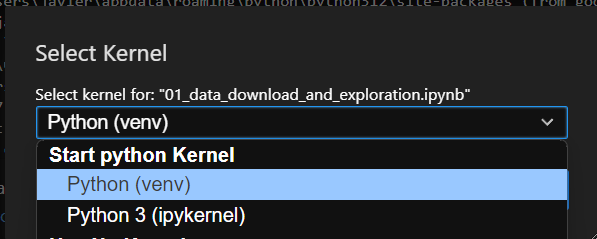

# Contributing to the TFG Repository

Since this is a repository for our TFG, only the team members will be contributing. However, we want to ensure a consistent workflow and commit history. 

## Workflow

We will be using **Gitflow** as our workflow:
- All work will be done in feature branches created from `develop`.
- Once a feature is complete, it will be merged into `develop` through a pull request.

## Virtual Environment Configuration (JupyterLab)

To execute this project, it will be necessary to configure a virtual environment, and register it as JupyterLab kernel. Follow this steps:

1. Create a virtual environment:
    In project's source execute:
    > python -m venv venv
2. Activate the virtual environment:
    > cd venv/Scripts
    > activate
3. Install dependencies:
    > pip install -r requirements.txt
4. Register kernel in JupyterLab
    > python -m ipykernel install --user --name=venv --display-name "Python (venv)"
5. Run JupyterLab and select the kernel:
    > jupyter lab
    

You will be now ready to use JupyterLab with the virtual environment!

## Commit Message Guidelines

We will follow the [**Conventional Commits**](https://www.conventionalcommits.org/en/v1.0.0/) standard for all commit messages. This ensures clear, consistent messages that describe the purpose of each commit.

Commit messages should follow this format:

> type: description
> 
> optional body
> 
> optional footer(s)

**Types**:
- `feat`: a commit of the type feat introduces a new feature to the codebase.
- `fix`:  a commit of the type fix patches a bug in your codebase.
- `docs`: a commit of the type docs introduces documentation.
- `style`: a commit of the type style introduces style changes (formatting, etc.).
- `refactor`: a commit of the type introduces refactoring code without changing behavior.
- `test`: a commit of the type test adds or updates tests.

    ...

**Example Commit Messages**:
- `feat: add model training code`
- `fix: correct data preprocessing bug`
- `docs: update README with project structure`

The team will allways follow the latest version of the Conventional Commits. **Actual version of use is 1.0.0**.